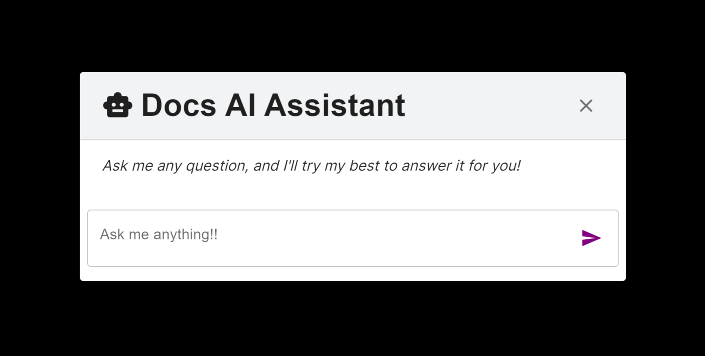

# Docs Chat Assistant
Documentation Chat Assistant component for `Next.js` using <a href='https://mui.com/material-ui/'>Material UI (MUI)</a> for component design and <a href='https://platform.openai.com/docs/api-reference/introduction'>OpenAI API</a> for AI Assistant integration and vector store.

## Contents
- <a href='https://github.com/arjunpatel-01/docs-chat-assistant/?tab=readme-ov-file#tech-stack'>Tech Stack</a>
  - <a href='https://github.com/arjunpatel-01/docs-chat-assistant/?tab=readme-ov-file#material-ui-mui'>Material UI (MUI)</a>
  - <a href='https://github.com/arjunpatel-01/docs-chat-assistant/?tab=readme-ov-file#markdown-response-styling'>Markdown Response Styling</a>
  - <a href='https://github.com/arjunpatel-01/docs-chat-assistant/?tab=readme-ov-file#html-parse'>HTML Parse</a>
- <a href='https://github.com/arjunpatel-01/docs-chat-assistant/?tab=readme-ov-file#usage'>Usage</a>
  - <a href='https://github.com/arjunpatel-01/docs-chat-assistant/?tab=readme-ov-file#installation'>Installation</a>
  - <a href='https://github.com/arjunpatel-01/docs-chat-assistant/?tab=readme-ov-file#setup'>Setup</a>
    - <a href='https://github.com/arjunpatel-01/docs-chat-assistant/?tab=readme-ov-file#openai-tools'>OpenAI Tools</a>
    - <a href='https://github.com/arjunpatel-01/docs-chat-assistant/?tab=readme-ov-file#environment-variables'>Environment variables</a>
    - <a href='https://github.com/arjunpatel-01/docs-chat-assistant/?tab=readme-ov-file#front-end'>Front-end</a>
    - <a href='https://github.com/arjunpatel-01/docs-chat-assistant/?tab=readme-ov-file#backend'>Backend</a>
      - <a href='https://github.com/arjunpatel-01/docs-chat-assistant/?tab=readme-ov-file#assistant-api'>Assistant API</a>
      - <a href='https://github.com/arjunpatel-01/docs-chat-assistant/?tab=readme-ov-file#web-crawler-api'>Web Crawler API</a>
- <a href='https://github.com/arjunpatel-01/docs-chat-assistant/?tab=readme-ov-file#styling'>Styling</a>
  - <a href='https://github.com/arjunpatel-01/docs-chat-assistant/?tab=readme-ov-file#assistant-props'>Assistant Props</a>
  - <a href='https://github.com/arjunpatel-01/docs-chat-assistant/?tab=readme-ov-file#fabprops'>FabProps</a>
  - <a href='https://github.com/arjunpatel-01/docs-chat-assistant/?tab=readme-ov-file#modalprops'>ModalProps</a>
  - <a href='https://github.com/arjunpatel-01/docs-chat-assistant/?tab=readme-ov-file#example'>Example</a>
- <a href='https://github.com/arjunpatel-01/docs-chat-assistant/?tab=readme-ov-file#limitations-052024'>Limitations</a>

<br/>

## Tech Stack
#### Material UI (MUI)
- <a href='https://mui.com/material-ui/react-dialog/'>`Dialog`</a>
- <a href='https://mui.com/material-ui/react-floating-action-button/'>`Floating Action Button`</a>
- <a href='https://mui.com/material-ui/api/icon-button/'>`Icon Button`</a>
- <a href='https://mui.com/material-ui/material-icons/'>`Icons`</a>
- <a href='https://mui.com/material-ui/api/linear-progress/'>`Linear Progress`</a>

#### Markdown Response Styling
- <a href='https://www.npmjs.com/package/react-markdown/v/8.0.6'>`react-markdown`</a>
- <a href='https://www.npmjs.com/package/react-syntax-highlighter'>`react-syntax-highlighter`</a>

#### HTML Parse
- <a href='https://cheerio.js.org/'>`Cheerio`</a>

## Usage
### Installation
```bash
npm install docs-chat-assistant
```

or

```bash
yarn add docs-chat-assistant
```

### Setup
#### OpenAI tools
1. First create a vector store <a href='https://platform.openai.com/storage/vector_stores'>here</a>.
   - Please note that this library only supports OpenAI vector stores at the moment.
2. At the bottom right of your created vector store, click ` + Create assistant ` to generate a new assistant.
3. Navigate to the <a href='https://platform.openai.com/assistants/'>Assistants page</a>, select the newly generated assistant, and ensure that `File search` is enabled and the proper vector store is attached.
4. Optional: Provide thorough instructions to the assistant for best response outputs.
   - e.g., "You are a helpful chat assistant for `'YOUR PRODUCT'`. Only answer questions relating to `'YOUR PRODUCT'`, and use the attached vector store to retrieve sources."

#### Environment variables
Set your variables in a .env file.
```.env
OPENAI_API_KEY="YOUR OPENAI API KEY"
OPENAI_ASSISTANT_ID="YOUR OPENAI ASSISTANT ID"
OPENAI_VECTORSTORE_ID="YOUR OPENAI VECTOR STORE ID"
```

#### Front-end
Import the component and plug it into your `Next.js` app.
The component has 2 mandatory props: `title` and `apiRoute`. 

See <a href='https://github.com/arjunpatel-01/docs-chat-assistant/#styling'>Styling Section</a> for more info on component props.

See <a href='https://github.com/arjunpatel-01/docs-chat-assistant/#backend'>Backend Section</a> to set up API routes. 

Example:
```javascript
import { OpenAIAssistant } from 'docs-chat-assistnant'

export default function Home() {
    return (
        <>
            {/* This is the component. It requires 2 props. */}
            <OpenAIAssistant
                title="Docs AI Assistant" //Replace with your title
                apiRoute="/api/assistant" //Replace with your API route. More on that in the backend section
            />

            {/*rest of your code*/}
        </>
    );
}
```

#### Backend
First, set up `Next.js` directory structure for APIs. See <a href='https://nextjs.org/docs/app/building-your-application/routing/route-handlers'>Next.js Documentation</a>.

Example directory:
```
project
├── app
│   ├── api
│   │   ├── assistant
│   │   │   ├── route.js
│   │   ├── crawler
│   │   │   ├── route.js
├── page.jsx
├── layout.jsx
├── ...
```

##### `Assistant API`: 
This method receives a `Request` containing a `message`, optional `instructions`, and an internally created `thread_id`. Calls are then made to OpenAI APIs to create (or add to) a message chain and to generate a stream response. The `OpenAIAssistant` component processes the API response and outputs the stream.

Usage:
```javascript
// example path: api/assistant/route.js
import { NEXT_ASSISTANT_API } from "docs-chat-assistant/api"
export { NEXT_ASSISTANT_API as POST }
```

##### `Web Crawler API`: 
This method receives an `string`containing a `base_url` to crawl. The host is extracted from the url, and the function iteratively retrieves all links from each page in a Breadth First Search manner. As the method visits each page, the contents are stored in files in a temporary directory. Finally, the files are uploaded to the vector store and the temporary directory is deleted. The function returns a Response with a `status` code and a `JSON body`.

**PLEASE NOTE THAT THIS METHOD SHOULD BE LOCKED BEHIND ADMIN PRIVILEDGES (AUTHENTICATION) BECAUSE IT DIRECTLY UPLOAD TO THE VECTOR STORE.**

Usage example:
```javascript
//example path: api/crawler/route.js
import { WEB_CRAWLER } from "docs-chat-assistant/api"
export async function POST(request) {
  const body = await request.json();

  //ensure this is protected by admin priviledges

  const base_url = body.base_url;
  return await WEB_CRAWLER(base_url);
}
```

<br/>

## Styling
### `Assistant Props`
Props of the Assistant component.

| Name | Type | Default | Description |
|------|------|---------|-------------|
| apiRoute | `string` | `-` | API route URL. <br/> **Required.** |
| buttonLabel | `string` | `'Ask AI'` | The label on the FAB. |   
| color | `string` | `'info'` | The color of the component. Affects FAB, Textfield, and Icons. Supports MUI Button color strings, CSS Standard colors, hex values, and rgb values. |
| FabProps | `FabProps` | `-` | Props to modify the Floating Action Button element. |
| formLabel | `string` | `'Ask me a question...'` | The label in the TextField. |
| icon | `React.JSX.Element` | AutoAwesomeIcon` | Insert React JSX Element to override default FAB icon. |
| iconSize | `'small'` &#124; `'medium'` &#124; `'large'` | `'large'` | The size of the FAB default icon. If icon prop is overridden, this prop will not affect React JSX Element size. |
| instructions | `string` | `-` | Additional instructions for OpenAI Assistant. |
| ModalProps | `ModalProps` | `-` | Props to modify the popup Modal element. |
| placeholder | `string` | `-` | The placeholder text before the user has sent the first message.Temporarily fills the space where the messages will be displayed and is replaced with message log once the first one is sent. |
| title | `string` | `-` | Title for the Modal. <br/> **Required.** |

### `FabProps`
Props of the Floating Action Button.

| Name | Type | Default | Description |
|------|------|---------|-------------|
| borderRadius | `string` &#124; `number` | If `variant` is `'circular'`, then `-`. <br/> If `variant` is `'extended'`, then `'.3rem'`. | Border curvature of FAB. <br/> **Cannot be set if `variant` = `'circular'`.** |
| bottom | `string` &#124; `number` | `35` | Vertical spacing of FAB from the bottom edge. |
| fontSize | `string` &#124; `number` | `.8rem` | Font size of FAB text. |
| height | `string` &#124; `number` | `73` | Height of FAB. |
| right | `string` &#124; `number` | `35` | Horizontal spacing of FAB from the right edge. |
| variant | `'circular'` &#124; `'extended'` | `'extended'` | Shape variant of FAB. If set to `'circular'`, the `borderRadius` prop will be disabled. |
| width | `string` &#124; `number` | `'73'` | Width of FAB. |
| zIndex | `(string & {})` &#124; `(number & {})` | `1` | Z-order of FAB. |

### `ModalProps`
Props of the Modal element.

| Name | Type | Default | Description |
|------|------|---------|-------------|
| maxWidth | `'sm` &#124; `'md'` &#124; `'lg'` | `'md'` | Max Width of the Modal. Grows with size of the screen. |
| titleVariant | `'body1'` &#124; `'body2'` &#124; `'caption'` &#124; <br/> `'h1'` &#124; `'h2'` &#124; `'h3'` &#124; <br/> `'h4'` &#124; `'h5'` &#124; `'h6'` &#124; <br/> `'subtitle1'` &#124; `'subtitle2'` | `'h5'` | Applies MUI Typography variant theme to Modal title. |
| zIndex | `(string & {})` &#124; `(number & {})` | `'2'` | Z-order of the Modal. |

### Example
This example uses all the available props.

```javascript
import { OpenAIAssistant } from 'docs-chat-assistnant'

export default function Home() {
    return (
        <>
            <Assistant
                title="Docs AI Assistant" //required
                apiRoute="/api/assistant" //required
                buttonLabel="Docs AI"
                color="purple"
                FabProps={{
                    borderRadius: ".5rem",
                    bottom: 40,
                    fontSize: "0.7rem",
                    height: 70,
                    right: 40,
                    variant: "extended",
                    width: 70,
                    zIndex: 2
                }}
                formLabel="Ask me anything!!"
                icon={RobotToyIcon}
                iconSize="large"    //this won't have any effect
                instructions="You are a helpful chat assistant."
                ModalProps={{
                    maxWidth: "sm",
                    titleVariant: "h4",
                    zIndex: 3
                }}
                placeholder="Ask me any question, and I'll try my best to answer it for you!"
            />
        </>
    );
}
```

 

<br/>

## Limitations (05/2024)
From testing and through personal experience, here are some of the limitations I experienced with the OpenAI Assistant API.
- The Assistant is not optimized for RAG. This doesn't mean that it is impossible; however, it runs into rate limits much quicker than others (struggles to loop through vector store and sometimes uses its own knowledge to answer questions instead), and file searching is simply adequate.
  - For better results, I suggest using a gpt 3.5 model that supports file search. With this, I have experienced faster responses and less hallucinations (and more focused responses).
- OpenAI threads does not have a batch delete option. 
  - Why this is important: When making an API call to begin chatting, a new thread will be created. However, every time the page is refreshed and the same user begins chatting again, a new thread will be created. Eventually, the owner of the OpenAI account will have a large number of idle threads that may or may not do anything. This can be solved through authenticating the user, but for a documentation site like <a href='https://docs.kapa.ai/'>docs.kapa.ai</a>, for example, it wouldn't make sense to have a authentication wall. So, having the option to batch delete means on page refresh, any old threads can be cleared. Another option is to store the threadIds in local storage to remove later, and that is currently the most appropriate solution, but there are also several limitations to that.

The following are limitations to this NPM package:
- Compatibility with other frameworks.
  - Currently, this package is only compatible with Next.js because it utilizes its seamless API capabilities.
  - Testing with Express has not gone well because the current API methods return a fetch API Response object. There is no easy conversion from one to the other, especially when dealing with ReadableStreams. There is a method called `fromWeb()` that may make the conversion simpler; however, it is labeled as experimental and should not be used in production level code.
- This package does not support other LLMs or Vector Stores.
- The Assistant API is not protected. While not technically a large issue since the concept is built around client-side interactions with your OpenAI Assistant, it could be abused if a user spams messages.
  - A great workaround is to set a rate limit on the frequency of API calls that can be made.
  - Another workaround is by implementing JWT/refresh tokens. however, the API doesn't include that out-of-the-box yet. This will likely be included in future versions.

<br/>

## LICENSE
[MIT](LICENSE)

<br/>

### Contributions are welcome!!